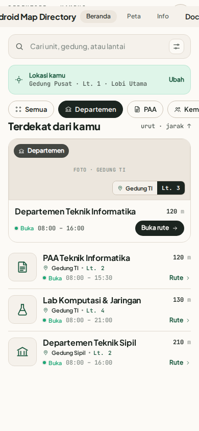
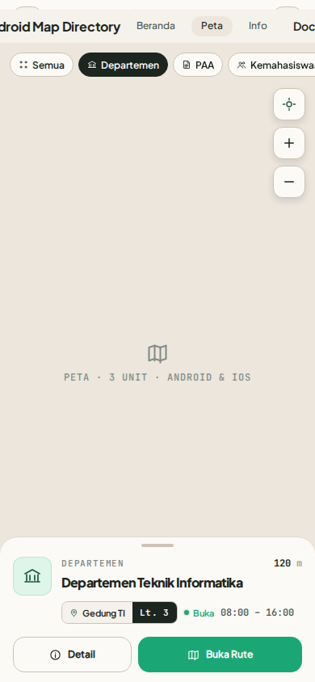
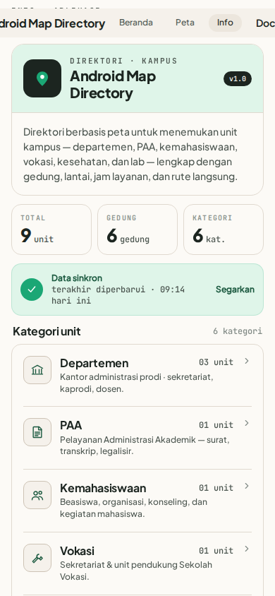

# Map Directory

Aplikasi direktori kampus berbasis React Native (Expo) untuk mencari dan menjelajahi unit-unit kampus — departemen, program studi, lab, dan kantor administrasi.

> Proyek Mata Kuliah Cloud Computing · Expo SDK 55 · TypeScript

---

## Screenshots

| Beranda | Peta | Info |
|:---:|:---:|:---:|
|  |  |  |

---

## Fitur

- **Beranda** — daftar unit dengan filter kategori, status buka/tutup, dan jarak
- **Peta** — peta kampus interaktif dengan pin lokasi tiap unit
- **Info** — detail unit: lantai, jam operasional, sub-ruangan, dan rating
- Dukungan tema terang/gelap otomatis
- Berjalan di Android, iOS, dan Web

## Tech Stack

| Layer | Teknologi |
|---|---|
| Framework | Expo SDK 55 + React Native 0.83 |
| Routing | Expo Router (file-based, typed routes) |
| Language | TypeScript (strict mode) |
| Maps | `react-native-maps` |
| Styling | Token-based theming (`src/constants/theme.ts`) |
| Build | EAS Build + EAS Submit |
| Compiler | React Compiler (enabled) |

## Struktur Direktori

```
src/
  app/
    _layout.tsx          # Root layout
    login.tsx            # Login screen
    (tabs)/
      index.tsx          # Beranda
      peta.tsx           # Peta kampus
      info.tsx           # Info
    unit/[id].tsx        # Detail unit
  components/            # UI primitives & atoms
  constants/
    theme.ts             # Color tokens, typography, spacing
    units.ts             # Data unit kampus
  hooks/
    use-theme.ts         # Active color scheme hook
```

Platform-specific variants use Metro extensions (`.web.tsx` for web).

## Menjalankan Aplikasi

```bash
npm install
```

```bash
npm start          # Dev server (pilih platform dari prompt)
npm run android    # Android emulator
npm run ios        # iOS simulator
npm run web        # Browser
npm run lint       # ESLint
```

Gunakan `npx tsc --noEmit` untuk type-check.

## Build & Deploy

Build menggunakan [EAS](https://expo.dev/eas). Profile tersedia: `development`, `preview`, `production`.

```bash
eas build --profile development --platform android
eas build --profile production --platform android
eas submit --platform android
```

## Referensi

- [Expo SDK 55 Docs](https://docs.expo.dev/versions/v55.0.0/)
- [Expo Router](https://docs.expo.dev/router/introduction/)
- [EAS Build](https://docs.expo.dev/build/introduction/)
- `Design.md` — design system & screen spec (color tokens, typography, component specs)
